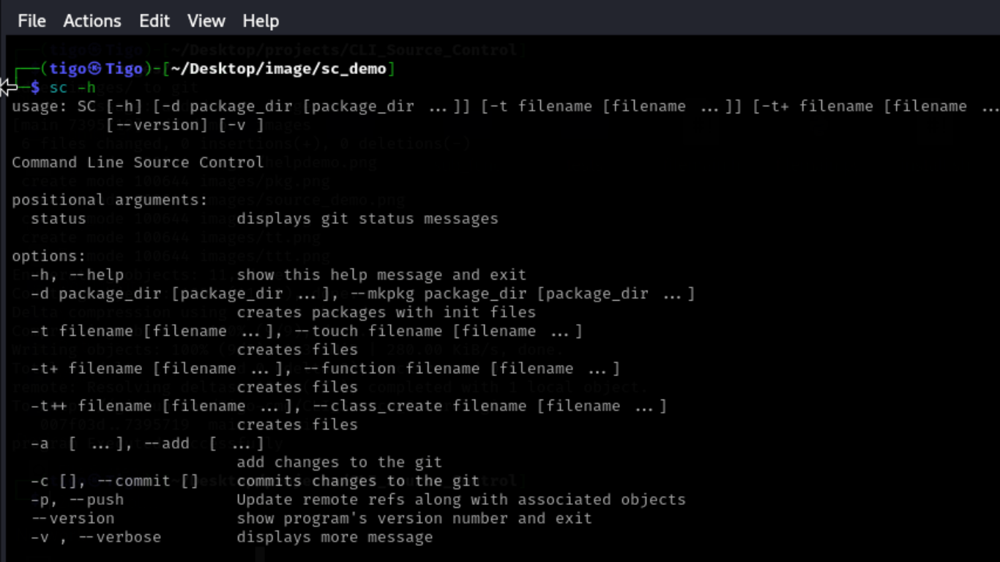

**# Command-Line Source Control (CLSC)
Welcome to CLSC, your command-line source control tool! CLSC is designed to simplify the management of your project's source code directly from your terminal. it's a user-friendly command-line source control tool designed to streamline your version control workflow. It empowers you to manage your code efficiently and collaboratively, directly from the terminal.


## Features:

- **Intuitive Commands**: Manage repositories with ease using simple commands.
- **Efficient Workflow**: Quickly commit changes, switch branches, and merge branches seamlessly.
- **Lightweight**: CLSC is designed to be fast and resource-efficient.
- **Cross-Platform**: Works smoothly on Windows, macOS, and Linux.
-- **Staging and Committing**: Stage specific files for inclusion in a commit and create meaningful commit messages.
-- **Lightweight and Efficient**: Operates efficiently from the command line, ideal for developers who prefer a streamlined experience.

-- offers a comprehensive set of commands for all your source control needs. Here's a quick overview:

    **init**: Initializes a new Git repository in the current directory.
    **status**: Shows the current status of your working directory and staging area.
    **add**: Adds files to the staging area for inclusion in the next commit.
    **commit**: Creates a new commit with a descriptive message.
    **branch**: Manages branches, including creating, listing, switching, and merging.
    **log**: Shows the commit history of your repository.
## Extra Feature:
-- **Create files: CLSC creates test startup files, python packages, py functions etc...


## Getting Started:

1. **Installation**:

   ```bash
   $ git https://github.com/Tigo-cmd/CLI_Source_Control.git
   $ cd CLI_Source_Control
   $ make install.sh executable (chmod +x install.sh)
   $ Run the script install.sh with sudo privileges to install ClSC on your computer
2. **Usage**:
   ```bash
   usage: SC [-h] [-d package_dir [package_dir ...]]
          [-t filename [filename ...]] [-t+ filename [filename ...]]
          [-t++ filename [filename ...]] [-a  [...]] [-c ] [-p]
          [--version] [-v ]

   options:
     -h, --help            show this help message and exit
     -d package_dir [package_dir ...], --mkpkg package_dir [package_dir ...]
                           creates packages with init files
     -t filename [filename ...], --touch filename [filename ...]
                           creates files
     -t+ filename [filename ...], --function filename [filename ...]
                           creates files
     -t++ filename [filename ...], --class_create filename [filename ...]
                           creates files
     -a  [ ...], --add  [ ...]
                           add changes to the git
     -c [], --commit []    commits changes to the git
     -p, --push            Update remote refs along with associated
                           objects
     --version             show program's version number and exit
     -v , --verbose        displays more message


# Contributing

We welcome contributions from the community to make CLSC even better. Whether you want to fix a bug, add a new feature, or improve documentation, your contributions are valuable. Follow these steps to contribute:

**Fork the Repository**: Fork the CLSC repository on GitHub to your own account.

**Clone the Repository**: Clone your forked repository to your local machine using Git. This allows you to make changes locally.
   ```bash
   git clone https://github.com/Tigo-cmd/CLI_Source_Control.git
 ```
**Create a Branch**: Create a new branch for your changes. Choose a descriptive name for the branch that summarizes the purpose of your changes.

   ```bash

   git checkout -b feature-branch
   ```

**Make Changes**: Make your desired changes to the codebase. Ensure that your changes adhere to the project's coding conventions and guidelines.

**Test Your Changes**: Test your changes locally to ensure they work as expected and do not introduce any regressions.

**Commit Your Changes**: Once you're satisfied with your changes, commit them to your local branch with a clear and descriptive commit message.

   ```bash

git add .
git commit -m "Add feature XYZ"
```

**Push Changes**: Push your changes to your forked repository on GitHub.

   ```bash

    git push origin feature-branch
   ```
**Submit a Pull Request**: Go to the GitHub page of your forked repository and submit a pull request (PR) from your feature branch to the main repository's main branch. Provide a detailed description of your changes in the pull request.

**Review and Iterate**: Your pull request will be reviewed by the project maintainers. Be responsive to any feedback or requests for changes. Iterate on your changes as needed until they are ready to be merged.

# License

CLSC is distributed under the MIT License. This means that you are free to use, modify, and distribute the software for any purpose.

# Contact Information

If you have any questions, feedback, or encounter issues with CLSC, please don't hesitate to reach out. You can contact the project maintainers through the following channels:

**GitHub Issues**: Report bugs or request features by opening an issue on the GitHub repository.
Email: Reach out via email at [EmmanuelTigo](emmanuelsticx6@gmail.com)

We value your input and appreciate your interest in contributing to CLSC. Thank you for your support!

For more hints on how to use the tool visit [CLSC Wiki](https://github.com/Tigo-cmd/CLI_Source_Control/wiki/CLSC-intoduction-and-usage)
